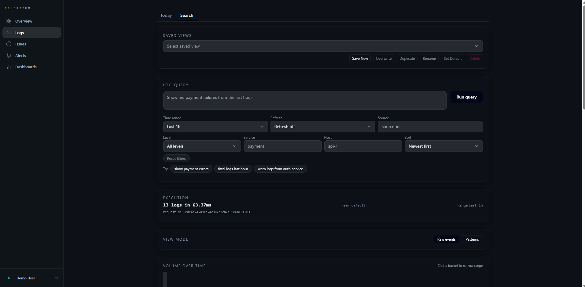

# Telerithm

**AI-powered log analytics for self-hosted teams.**

[](https://github.com/LanNguyenSi/telerithm/actions/workflows/ci.yml) [](LICENSE)

Telerithm turns plain-language questions into structured queries over your logs. Instead of grepping millions of lines or hand-writing SQL, you ask _"show me payment errors from the last hour"_ and the AI translates it into filters, a time range, and a search plan you can review and edit. Self-hosted, single-tenant by default, OpenAI-compatible (cloud or local LLM). Backend is Node.js/Express with Prisma over PostgreSQL and ClickHouse for log storage; frontend is Next.js. See [docs/architecture.md](docs/architecture.md) for how the pieces fit together.



## Key features

- Natural-language search with an editable AI-generated filter plan
- Real-time SSE log streaming, Today view, log detail with surrounding context
- Saved views, faceted search, histograms, automatic pattern clustering
- Multi-source ingestion: HTTP, Syslog (UDP/TCP), Filebeat, Docker, CloudWatch
- Alert rules and incidents, maintenance windows, notification channels (Email, Webhook, Slack, Microsoft Teams)
- Error grouping with fingerprinting and an assignment workflow
- Team management with RBAC (Owner, Admin, Member, Viewer), invites, and an admin API; single-tenant by default, optional multi-tenant via config flag
- Prometheus metrics endpoint (`/metrics`) covering HTTP, ingest, alert, SSE, and NLQ stats

**Planned:** escalation policies (schema exists, evaluation not yet wired), AI root-cause analysis, anomaly detection, custom dashboards, SSO/OIDC, retention policies, `telerithm` CLI.

## Quick start

**Live demo (no install):** [demo.telerithm.cloud](https://demo.telerithm.cloud)

**Self-host:**

Prerequisites: Docker Engine 20.10+, Docker Compose v2, and make. The local stack needs no Traefik; [DEPLOYMENT.md](DEPLOYMENT.md) covers production.

```bash
git clone https://github.com/LanNguyenSi/telerithm.git
cd telerithm
make init
```

That builds the stack and starts everything on Docker:

| Service  | URL                         |
| -------- | ---------------------------- |
| Frontend | http://localhost:3000        |
| Backend  | http://localhost:4000        |
| API docs | http://localhost:4000/docs   |

Send a log, then ask a question:

```bash
curl -X POST http://localhost:4000/api/v1/ingest/<sourceId> \
  -H "X-API-Key: <apiKey>" -H "Content-Type: application/json" \
  -d '{"logs":[{"level":"error","service":"payment","message":"Payment authorization failed for order 4721","fields":{"status_code":502,"amount":189.50}}]}'
```

## Usage

`POST /api/v1/query/natural` with `{"teamId":"...", "query":"payment errors in the last hour"}` returns the AI's structured plan:

```json
{
  "explanation": "Filtered to service=payment and level=error over the last hour.",
  "filtersApplied": [
    { "field": "level",   "operator": "eq",       "value": "error"   },
    { "field": "service", "operator": "contains", "value": "payment" }
  ],
  "inferredTimeRange": {
    "startTime": "2026-04-28T09:14:00Z",
    "endTime":   "2026-04-28T10:14:00Z"
  },
  "textTerms": ["payment", "errors"],
  "warnings": []
}
```

The frontend renders this as editable filter chips plus a timeline view, so you can refine the AI's interpretation before running the search. If `OPENAI_API_KEY` is unset, Telerithm falls back to a deterministic heuristic translator (no LLM call, no cloud dependency). All endpoints live under `/api/v1`; see [docs/api.md](docs/api.md) for the full reference, or `GET /openapi.json` for the machine-readable spec.

## Documentation

| If you want to...                                            | Read                                         |
| ------------------------------------------------------------- | --------------------------------------------- |
| Read the pitch and roadmap                                    | [telerithm.cloud](https://telerithm.cloud)    |
| Understand the ingestion + AI pipeline                        | [docs/architecture.md](docs/architecture.md)  |
| Configure env vars, ingestion sources, LLM provider           | [docs/configuration.md](docs/configuration.md) |
| Write better natural-language queries, see prompt patterns    | [docs/queries.md](docs/queries.md)            |
| See the full REST API reference and rate limits per route group | [docs/api.md](docs/api.md)                  |
| Run on a VPS with Traefik + SSL                                | [DEPLOYMENT.md](DEPLOYMENT.md)                |
| Run a local LLM (llama.cpp, Ollama) instead of cloud            | [LOCAL_LLM.md](LOCAL_LLM.md)                  |
| Use the JavaScript/TypeScript client SDK                      | [packages/sdk-js/README.md](packages/sdk-js/README.md) |

## Development and contributing

```bash
cd backend && npm test              # vitest integration tests
cd backend && npx tsc --noEmit      # type check
cd frontend && npx tsc --noEmit     # type check
```

See [CONTRIBUTING.md](CONTRIBUTING.md) for the full workflow. Release notes live in [CHANGELOG.md](CHANGELOG.md) (app) and [packages/sdk-js/CHANGELOG.md](packages/sdk-js/CHANGELOG.md) (SDK, versioned independently).

## License

[MIT](LICENSE)
